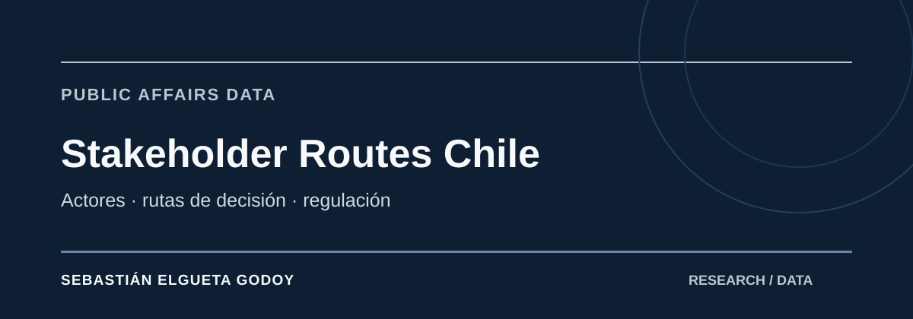

# Stakeholder Routes Chile

**Latest GitHub release:** [v0.3.0](https://github.com/selguetagodoy/stakeholder_routes_Chile/releases/tag/v0.3.0) · **Latest Zenodo-archived version:** [v0.2.0](https://github.com/selguetagodoy/stakeholder_routes_Chile/releases/tag/v0.2.0) · [Concept DOI: 10.5281/zenodo.22921233](https://doi.org/10.5281/zenodo.22921233) · [v0.2.0 DOI: 10.5281/zenodo.22921234](https://doi.org/10.5281/zenodo.22921234)

 

**Public dataset landing page:** https://selguetagodoy.github.io/dataset-stakeholder-routes-chile.html

**Open decision-route and stakeholder-mapping dataset for public affairs, regulation and investment projects in Chile.**

> **Versioning note:** the repository currently reflects GitHub release **v0.3.0**. The latest version with a confirmed version-specific Zenodo DOI is **v0.2.0**. v0.3.0 has not yet been assigned a separate verified version DOI in the public metadata checked on 2026-09-27.

This repository answers a different question from an institutional directory: **who intervenes, at what stage, with what competence, and what decision or output can result?**

**Author profile:** https://selguetagodoy.github.io/

It is designed as a companion to [Chile State Institutional Map](https://github.com/selguetagodoy/chile-state-institutional-map-).

## Monitoring layer — 2026-09-19

The current release contains **22 routes**, **72 actor-stage records**, **21 policy-competence mappings**, **17 explicit decision points**, **49 indexed actors** and **16 conditional route relationships**. It also adds a dated monitoring snapshot with **13 current authorities**, **7 regulatory consultations** and **8 regulatory-calendar milestones**. Coverage now spans environmental assessment and PAS, urban/building permits, electricity, telecommunications, water, mining, public procurement, merger control, foreign investment, cybersecurity, financial regulation, health authorizations, archaeology/heritage, maritime concessions, public-works concessions, native forest, aquaculture, consumer protection and a composite data-center route.

### Web explorer

A searchable, self-contained explorer is available at `docs/index.html` and is prepared for publication from the repository's `/docs` folder with GitHub Pages. It supports free-text search and filtering by policy area and route type.

### Live monitoring

The monitoring layer is deliberately separated from the structural route model. Authority names, consultations and calendar milestones are volatile and every row carries a verification date. The public monitoring view is in `docs/monitoring.html`.

### Core files

- `data/route_catalog.csv` — one row per route, its trigger, main actor, output and scope limitations.
- `data/stakeholder_routes.csv` — route × stage × actor matrix.
- `data/policy_competences.csv` — institution × policy area × competence.
- `data/decision_points.csv` — where an approval, rejection, authorization, award or regulatory decision actually occurs.
- `data/actor_index.csv` — actor → routes index, useful for stakeholder prioritization without assigning political influence scores.
- `data/route_dependencies.csv` — conditional relationships between routes; distinguishes overlap from legal sequencing.
- `data/current_authorities.csv` — dated snapshot of current officeholders for institutions participating in the routes.
- `data/consultations.csv` — open and recent regulatory/public consultation tracker.
- `data/regulatory_calendar.csv` — upcoming and completed regulatory milestones with exact or explicitly derived date basis.
- `sources.csv` — primary-source ledger.
- `docs/methodology.md` — rules for sequencing, conditionality and evidence.
- `docs/data_dictionary.md` — field definitions.
- `docs/index.html` — searchable public-facing route explorer.

## Important distinction

A **stakeholder route is not automatically a legal checklist**. Some routes are statutory procedures; others are sectoral authorizations, compliance pathways, facilitation services or analytical composites.

The data-center route is deliberately marked `composite_stakeholder_route`: there is no single universal legal sequence for every data-center project. Environmental, municipal, electricity, water and telecom steps depend on the project's characteristics.

## Public-affairs uses

- stakeholder mapping
- regulatory intelligence
- investment project navigation
- permitting analysis
- institutional strategy
- public procurement analysis
- due diligence
- comparative LATAM public-affairs research

## Data protection transition

As of **2026-09-19**, Law N°21.719 has deferred entry into force to **2026-12-01**. A future personal-data route should therefore be versioned by effective date rather than presenting the new Agency framework as already operative.

## Provenance and QA

[SOURCE_OF_TRUTH.md](SOURCE_OF_TRUTH.md) defines the hierarchy between primary sources, structural route tables, volatile monitoring layers and public explorer pages. [sources.csv](sources.csv) remains the canonical primary-source ledger.

The validation workflow checks structural relationships and source references. A separate weekly source-health workflow tests registered URLs without changing any route. This preserves the distinction between evidence monitoring and substantive legal/regulatory interpretation.

## Author

**[Sebastián Elgueta Godoy](https://selguetagodoy.github.io/)** — Sociologist · Public Affairs · Public Policy · Regulation · Digital Infrastructure · Latin America.

[Professional profile](https://selguetagodoy.github.io/bio.html) · [Research](https://selguetagodoy.github.io/investigacion.html) · [GitHub profile](https://github.com/selguetagodoy)

All routes prioritize primary institutional sources and preserve conditionality rather than inventing mandatory steps.

## Related research

- [Chile State Institutional Map](https://selguetagodoy.github.io/dataset-chile-state-institutional-map.html) — institutional backbone for public-affairs analysis.
- [Latin America Digital Infrastructure](https://selguetagodoy.github.io/dataset-latin-america-digital-infrastructure.html) — regional infrastructure benchmark and institutional context.
- [Public affairs and regulatory analysis](https://selguetagodoy.github.io/asuntos-publicos.html) — thematic public research hub.

